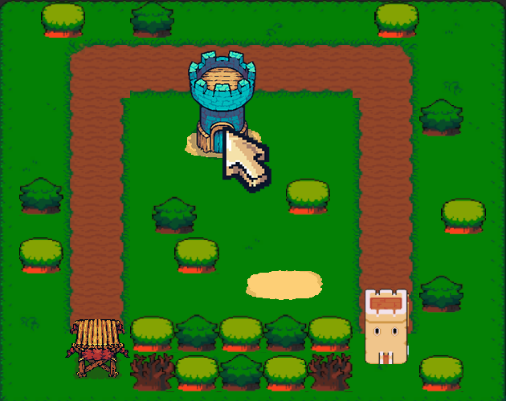
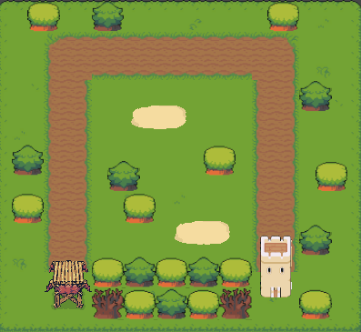
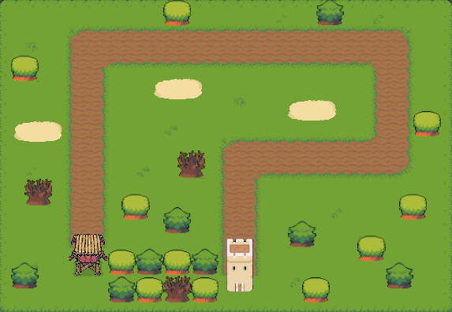
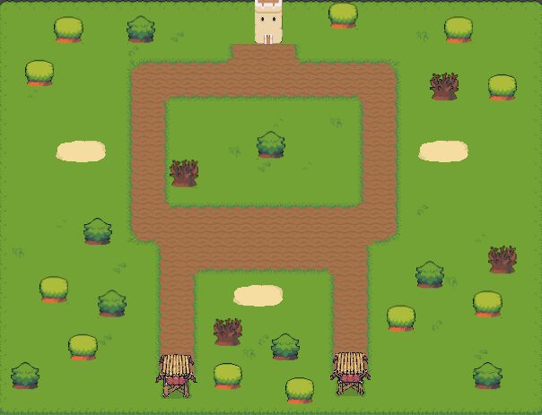

<b>My game here</b> - https://boltach.itch.io/guardians-of-the-realm  

<b>Hi!</b> I am developing a game on Unity, for my portfolio, planning to release the game on itch

Started development on June 5  
I use free assets from itch  
If you found a bad piece of code, please give advice! I'd appreciate it:3

<b>Maps in Game:</b>

